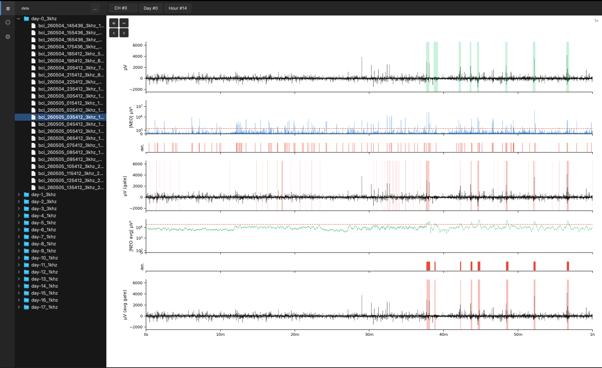

# RHD Viewer

A desktop viewer and seizure annotation interface for Intan RHD2000 neural recording files, built for the VerifyHalo FPGA seizure detection pipeline.

---

## Download & Install

Go to the [latest release](https://github.com/VerifyHalo/FPGARuns/releases/latest) and download the file for your platform.

### Windows

1. Download `RHD Viewer.exe`
2. Double-click to launch. No installation required.

> Windows may show a SmartScreen warning on first launch. Click **More info** then **Run anyway** to proceed.

### macOS

1. Download `RHD Viewer.dmg`
2. Open the `.dmg` file
3. Drag **RHD Viewer** into your Applications folder
4. Eject the disk image

**First launch:** macOS will block the app because it is not notarized. To open it the first time, right-click the app in Applications, choose **Open**, then click **Open** in the dialog. After that it opens normally.

---

## Usage

1. Launch RHD Viewer
2. Click the **≡** icon in the left bar and use the **...** button to select the folder containing your `.rhd` files
3. Click any file in the tree to load it
4. Open the Settings panel (**⊞**) to adjust detection parameters and click **Reload**
